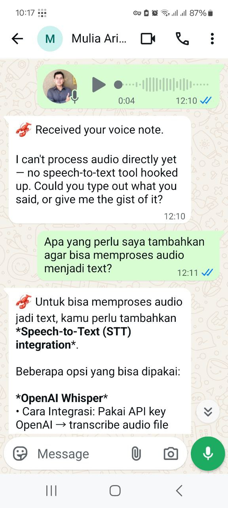
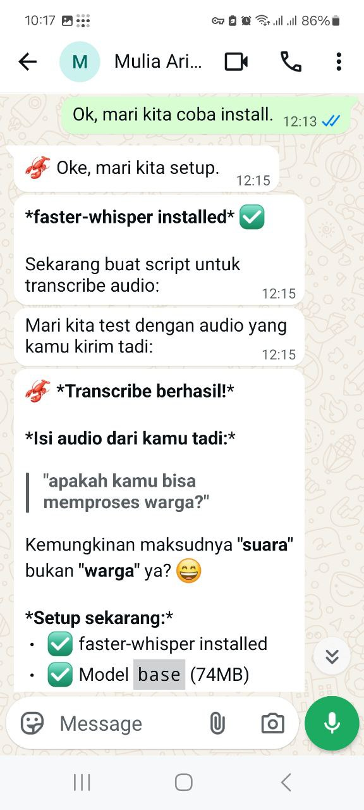
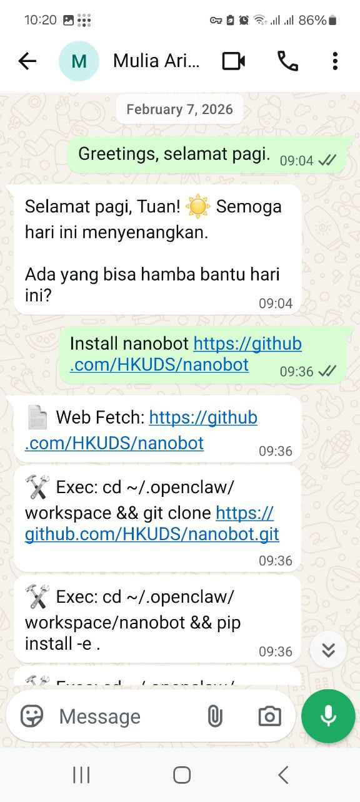
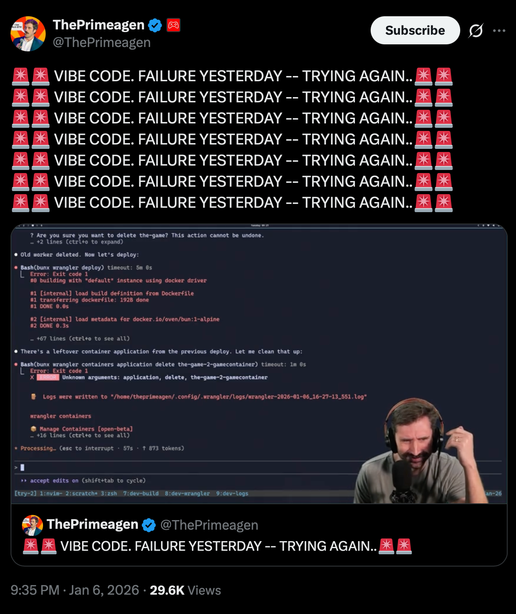

<!-- _class: lead -->
<!-- _paginate: false -->

# The Future of Software Engineering

### From Traditional Development to AI-Powered Engineering

---

<!-- _class: lead -->

# Who am I?

---

## Agenda

- Sejarah AI
- Apa Itu AI & LLM
- Vibe Coding
- Context Engineering
- Spec Driven Development
- Praktek: Building App with AI

---

<!-- _paginate: false -->





---

## Sejarah AI (1/2)

- **1950s** - Alan Turing: "Can machines think?"
- **1960s-80s** - Expert systems & rule-based programming
- **2010s** - Machine learning & deep learning revolution
- **2017** - Arsitektur **Transformer** — fondasi semua LLM
- **2018** - OpenAI merilis **GPT-1** (117M parameter)
- **2020** - **GPT-3** (175B parameter) — bisa menulis kode & esai
- **2021** - GitHub **Copilot**: AI coding assistant pertama

---

## Sejarah AI (2/2)

- **2022** - **ChatGPT** dirilis, 1 juta user dalam 5 hari
- **2023** - GPT-4, Claude, Gemini: model multimodal & reasoning
- **2023** - Cursor IDE: AI-first code editor
- **2024** - Devin, OpenHands: AI yang bisa koding mandiri
- **2024** - AI agent bisa akses terminal, browser, file system
- **2025** - Claude Code, multi-agent workflows, vibe coding
- **2026** - **Seedance 2.0**: AI generate video dari teks singkat

---

<!-- _class: lead -->
<!-- _paginate: false -->

<video src="anak_sd_makan_soto.mp4" controls width="100%" style="max-height: 80vh; border-radius: 8px;"></video>

---

## Apa Itu AI?

- **Artificial Intelligence** - Mesin yang bisa "berpikir" dan mengambil keputusan
- **Large Language Models (LLM)** - Model bahasa yang dilatih dengan data masif
- **Generative AI** - AI yang bisa menghasilkan konten baru (teks, kode, gambar, video)

---

## Penjelasan LLM

- **Large Language Model** = model AI yang dilatih dengan miliaran teks
- Prediksi *next token* berdasarkan konteks sebelumnya
- Tidak benar-benar "mengerti", tapi sangat baik dalam pattern matching
- Memiliki **context window** (jumlah token yang bisa diproses sekaligus)
- Semakin baik konteks yang diberikan, semakin baik hasilnya

---

## Traditional Development

- Manual coding dari requirements ke implementasi
- Waterfall & Agile sebagai framework utama
- Developer menulis setiap baris kode secara manual
- Testing, deployment, monitoring dilakukan terpisah
- Bottleneck: kecepatan development bergantung pada jumlah developer

---

## Kapabilitas AI Saat Ini

- Code generation (GitHub Copilot, Cursor, Claude Code)
- Automated testing & debugging
- Code review & refactoring
- Natural language to code
- Multi-modal AI (text, image, audio, video)

---

## Prediksi Elon Musk
- Proses saat ini — tulis kode, compiler terjemahkan ke binary — **tidak efisien**
- Visi Musk: manusia cukup **describe what they want** → AI langsung generate binary
- Tidak perlu lagi bahasa pemrograman sebagai perantara
- AI akan langsung menghasilkan **optimized machine code**
- Prediksi: terjadi di **akhir 2026**
- Jika benar, peran developer bergeser total ke **problem definition**

---

## Development di Era AI

- AI sebagai **pair programmer**, bukan pengganti developer
- Shift dari *writing code* ke *directing code*
- Developer sebagai **architect & reviewer**
- Faster prototyping & iteration
- Focus bergeser ke **problem solving** dan **system design**

---

## Skill yang Dibutuhkan di Era AI

- **Prompting & Context Engineering** - Komunikasi efektif dengan AI
- **System Design & Architecture** - Memahami big picture
- **Code Review & Critical Thinking** - Validasi output AI
- **Domain Knowledge** - AI butuh konteks bisnis dari manusia
- **Adaptability** - Tools dan paradigma berubah cepat

---

<!-- _class: lead -->

# Context Engineering

---

<!-- _class: lead -->

# Vibe Coding

---

## Apa Itu Vibe Coding?

- Bilang ke AI apa yang kamu mau → AI akan membuatnya
- Tidak perlu baca kode, cukup klik **accept & run**
- Seperti **pesan makanan via app** — tinggal pilih, tidak perlu memasak

---



---

## Masalah dengan Vibe Coding

- ❌ **Kode berantakan** — makin besar project, makin kacau
- ❌ **Amnesia** — AI tidak ingat keputusan sebelumnya
- ❌ **Tidak bisa diperbaiki** — kode yang tak dibaca = kode yang tak dipahami
- ❌ **Rawan bolong** — AI bisa bikin celah keamanan tanpa sadar
- ❌ **Tanpa panduan** — tidak ada spec, tidak ada tes
- 💡 Kita butuh pendekatan yang lebih **terstruktur**...

---

## Penjelasan Prompt

- **Prompt** = instruksi yang kita berikan ke AI
- Prompt adalah *interface* antara manusia dan LLM
- Kualitas output **berbanding lurus** dengan kualitas prompt
- Prompt yang baik: jelas, spesifik, dan memiliki konteks

> "Garbage in, garbage out" berlaku sangat kuat untuk AI

---

## Elemen-elemen Prompt

### Instruction
Apa yang kita ingin AI lakukan

### Context
Informasi latar belakang yang relevan

### Constraints
Batasan dan aturan yang harus diikuti AI

---

## Instruction

```
Buatkan REST API endpoint untuk user registration
menggunakan Node.js dan Express.
```

- Harus **spesifik** dan **actionable**
- Gunakan kata kerja yang jelas: *buatkan*, *analisis*, *refactor*, *jelaskan*
- Satu instruksi per task untuk hasil terbaik

---

## Context

```
Project ini menggunakan:
- Node.js v20 dengan TypeScript
- PostgreSQL sebagai database
- Prisma sebagai ORM
- Jest untuk testing
```

- Berikan informasi tentang **tech stack**
- Sertakan **code yang sudah ada** jika relevan
- Jelaskan **business logic** dan requirements

---

## Constraints

```
Requirements:
- Gunakan Express.js router
- Validasi input menggunakan Zod
- Password harus di-hash dengan bcrypt
- Return format harus JSON API standard
- Jangan gunakan library tambahan selain yang disebutkan
```

- Batasi format output
- Tentukan apa yang **boleh** dan **tidak boleh** dilakukan
- Tentukan standar dan konvensi yang harus diikuti

---

## Basic Prompting (1/2)

**Zero-shot** - Langsung bertanya tanpa contoh
```
Buatkan fungsi untuk validasi email
```

**One-shot** - Memberikan satu contoh
```
Contoh: validatePhone("+628123") -> true
Buatkan fungsi serupa untuk validasi email
```

---

## Basic Prompting (2/2)

**Few-shot** - Memberikan beberapa contoh
```
Input: "hello world" -> Output: "Hello World"
Input: "foo bar baz" -> Output: "Foo Bar Baz"
Buatkan fungsi untuk transformasi ini
```

**Chain-of-thought** - Minta AI berpikir step-by-step
```
Jelaskan langkah-langkah untuk membuat
fitur autentikasi, kemudian implementasikan.
```

---

## Teknik Prompting

- **Chain of Thought** - Minta AI berpikir langkah demi langkah
- **Role Prompting** - "Kamu adalah senior backend engineer..."
- **Structured Output** - Minta output dalam format tertentu (JSON, XML)
- **Iterative Refinement** - Perbaiki prompt berdasarkan hasil sebelumnya
- **Decomposition** - Pecah masalah besar jadi sub-masalah kecil

---

## AI Agent

- AI yang bisa **mengambil aksi** secara otonom
- Memiliki akses ke **tools**: file system, terminal, browser, API
- Loop: *Think* -> *Act* -> *Observe* -> *Repeat*
- Contoh: OpenCode, AntiGravity, Claude Code, Cursor Agent, Devin
- Bisa melakukan multi-step tasks tanpa intervensi manual

---

## Context Engineering

- **Context window** terbatas, harus dikelola dengan baik
- Gunakan file referensi: `AGENTS.md`, `CLAUDE.md`, `GEMINI.md`, `.cursorrules`
- Sediakan **documentation** dan **specs** yang jelas
- Berikan hanya konteks yang **relevan**, jangan berlebihan
- Context engineering is better than prompt engineering

---

<!-- _class: lead -->

# Spec Driven Development

---

## Apa Itu Spec Driven Development?

- Menulis **spesifikasi** sebelum menulis kode
- Spec menjadi *single source of truth* untuk AI dan manusia
- Format: Markdown, YAML, atau structured documents
- AI menggunakan spec sebagai **context** untuk generate code

---

## Mengapa Spec Driven?

- AI bekerja lebih baik dengan **instruksi terstruktur**
- Mengurangi ambiguitas dan miskomunikasi
- Spec bisa di-review sebelum coding dimulai
- Reproducible: spec yang sama dapat memberikan hasil yang lebih konsisten
- Dokumentasi otomatis tersedia sejak awal

---

## Komponen Spec

- **Overview** - Deskripsi singkat fitur
- **Requirements** - Functional & non-functional requirements
- **Data Model** - Schema, types, dan relasi
- **API Contract** - Endpoints, request/response format
- **UI/UX Flow** - User journey dan wireframe description
- **Acceptance Criteria** - Definition of done

---

## Workflow Spec Driven Development

1. **Define** - Tulis spec dari requirements
2. **Review** - Review spec bersama tim
3. **Generate** - Gunakan AI untuk generate code dari spec
4. **Validate** - Review dan test generated code
5. **Iterate** - Perbaiki spec jika hasil belum sesuai

---

<!-- _class: lead -->

# Building Applications Without Writing Code

---

## Praktek: Agentic AI + Spec Driven Development

- Membuat fitur menggunakan AI agent
- Developer berperan sebagai **architect & director**
- AI agent mengeksekusi berdasarkan spec
- Focus pada **what to build**, bukan **how to code**

---

## Tools yang Digunakan

- **OpenCode** - AI coding agent (free model tersedia)
- **Git** - Version control tetap penting
- **Terminal** - Untuk running OpenCode & testing
- Spec files sebagai **panduan utama** AI

---

## Best Practices

- Selalu **review** code yang dihasilkan AI
- Gunakan **version control** dari awal
- Tulis spec yang **detail** dan **tidak ambigu**
- Iterasi kecil lebih baik dari satu langkah besar
- Pahami code yang dihasilkan, jangan *blindly accept*
- AI adalah **tool**, bukan pengganti critical thinking

---

<!-- _class: lead -->

## Key Takeaway

> Software engineering bukan lagi tentang
> **menulis kode**, tapi tentang **mengarahkan AI**
> dengan konteks yang tepat untuk
> **membangun solusi** yang benar.

---

<!-- _class: lead -->
<!-- _paginate: false -->

# Thank You

### Questions?
